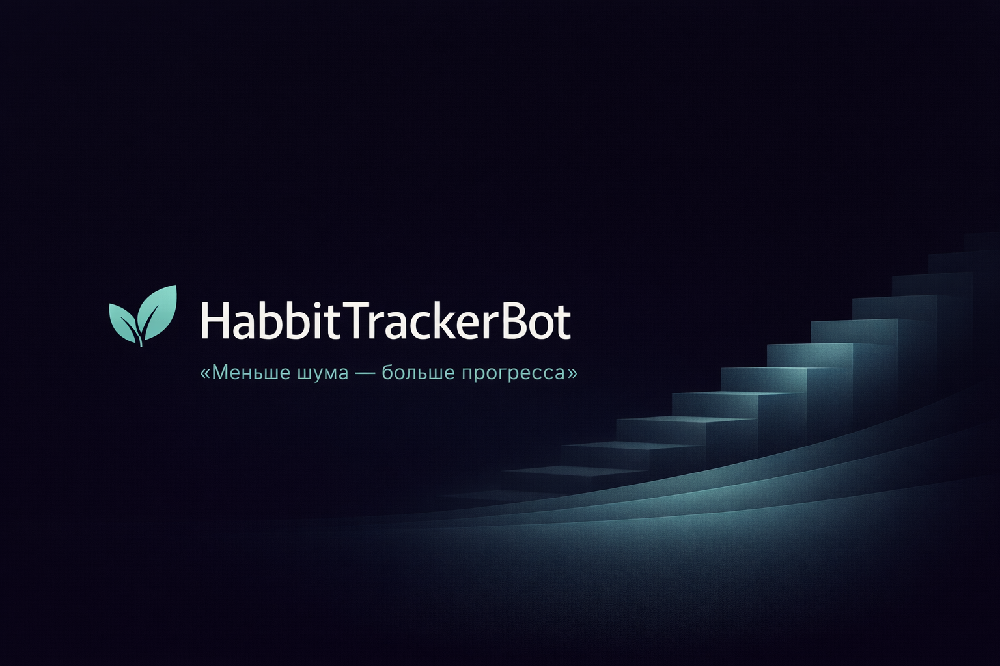
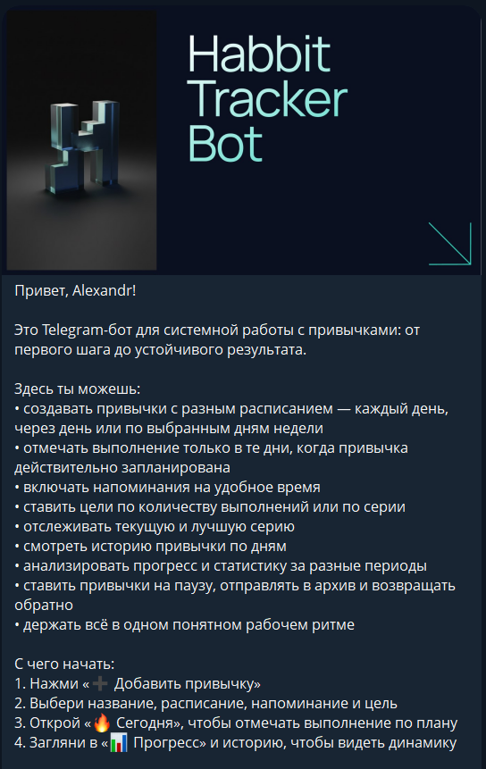
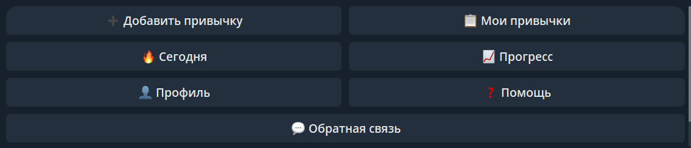
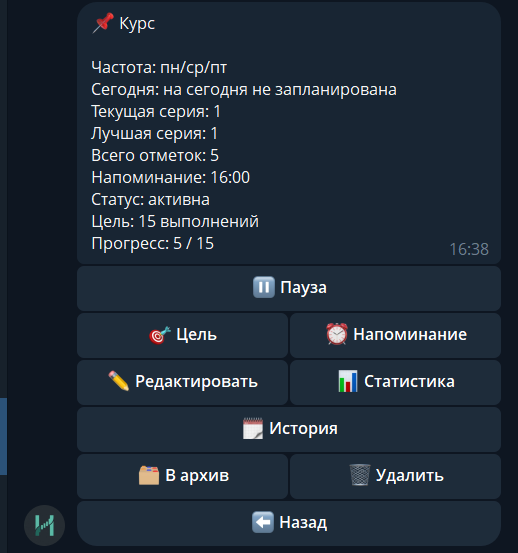
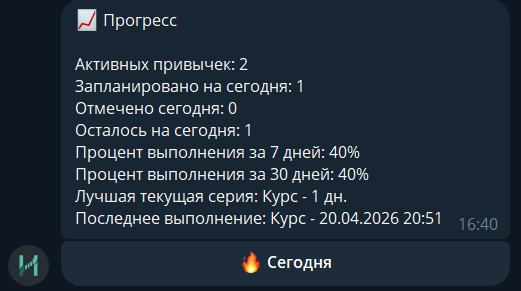
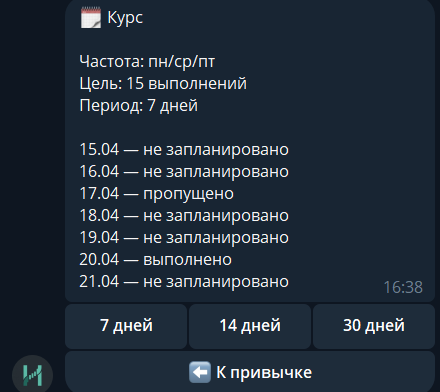
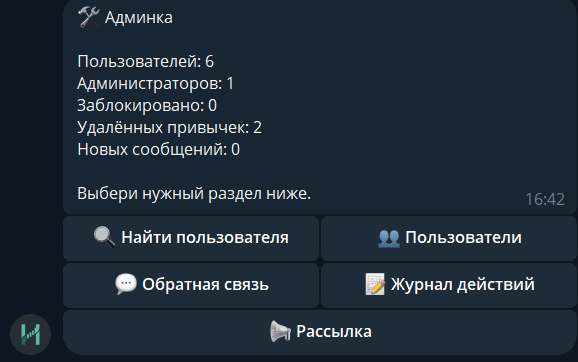

# HabitTrackerBot

> «Меньше шума — больше прогресса»

HabitTrackerBot — Telegram-бот для людей, которые хотят вести привычки без лишнего шума: планировать расписание, получать напоминания, отмечать прогресс и видеть историю выполнения. Технически это production-style portfolio project, а не учебная заготовка: проект собран как многослойное асинхронное приложение на `aiogram`, `FastAPI`, `SQLAlchemy`, `PostgreSQL`, `Redis` и `Celery`.

> Note: the current local project folder may still be named `HabbitTrackerBot`. This README uses the intended public display name: `HabitTrackerBot`.

**Навигация:** [Возможности](#возможности) • [For reviewers](#for-reviewers) • [Technical highlights](#technical-highlights) • [Стек](#стек) • [Архитектура](#архитектура) • [Скриншоты](#скриншоты) • [Environment variables](#environment-variables) • [Database & migrations](#database--migrations) • [Запуск локально](#запуск-локально) • [Тесты](#тесты) • [Admin setup](#admin-setup) • [Security / Publishing checklist](#security--publishing-checklist) • [Статус проекта](#статус-проекта) • [Roadmap](#roadmap)

## Возможности

- Создание привычек с разными сценариями расписания: каждый день, через день, по выбранным дням недели
- Отметка выполнения на текущий день и работа с экраном "Сегодня"
- Цели по количеству выполнений и по длине серии
- История привычки, текущая и лучшая серии, прогресс за последние 7, 14 и 30 дней
- Напоминания и автоматические сводки в локальном времени пользователя
- Пауза и мягкое удаление привычек с возможностью восстановления
- Обратная связь от пользователей
- Админ-панель: поиск пользователей, блокировка, выдача прав, ответы на обращения, action log, рассылка

## For reviewers

- Layered architecture: handlers, services, repositories, models.
- Async Telegram bot on aiogram 3.
- PostgreSQL persistence with SQLAlchemy and Alembic migrations.
- Redis + Celery for scheduled reminders and summaries.
- FastAPI healthcheck for infrastructure monitoring.
- Docker Compose setup for local infrastructure.
- Pytest-based test suite for core project logic.

## Technical highlights

- **Bot flow:** Telegram commands and callbacks are handled through aiogram routers, middlewares and keyboards inside `app/bot`.
- **Database layer:** SQLAlchemy models describe users, habits, logs, plans, subscriptions, feedback and admin action logs; repositories isolate database access from business logic.
- **Background tasks:** Redis and Celery are used for scheduled reminders and progress summaries; a simplified local mode can run without Redis/Celery.
- **Healthcheck:** FastAPI provides a lightweight HTTP layer with `GET /health` for infrastructure checks.
- **Tests:** pytest-based tests cover services, bot handlers, navigation text and middleware behavior.
- **Security / publishing preparation:** `.env` is excluded from Git, `.env.example` is used as a template, and local runtime artifacts are ignored.

## Стек

- Python 3.10
- aiogram 3
- FastAPI
- SQLAlchemy 2
- Alembic
- PostgreSQL
- Redis
- Celery
- pytest + pytest-asyncio
- Docker Compose

## Архитектура

Проект собран по простой прикладной схеме: `handlers -> services -> repositories`.

Слои приложения:

- `handlers` принимают команды и callback-и Telegram, валидируют пользовательский сценарий и передают управление дальше
- `services` содержат бизнес-логику: привычки, цели, прогресс, напоминания, админские действия, feedback и рассылка
- `repositories` изолируют работу с базой данных и не смешивают SQL-доступ с логикой сценариев
- `workers` выполняют фоновые задачи для напоминаний и сводок
- `api` держит служебный HTTP-слой, в том числе `GET /health`

Ключевые директории:

```text
app/
  api/           FastAPI-приложение и healthcheck
  bot/           Telegram-бот: handlers, keyboards, middlewares
  core/          конфигурация, подключение к БД, Redis, логирование
  models/        SQLAlchemy-модели
  repositories/  слой доступа к данным
  services/      бизнес-логика
  workers/       Celery worker и периодические задачи
migrations/      Alembic-миграции
tests/           тесты сервисов, handlers и middleware
```

## Скриншоты

### Стартовый экран


### Главное меню


### Карточка привычки


### Прогресс


### История привычки


### Админка


## Environment variables

Шаблон переменных окружения лежит в [`.env.example`](./.env.example). Реальные значения должны храниться только в локальном `.env` и не должны попадать в Git.

| Variable | Required | Description |
|---|---|---|
| `APP_NAME` | No | Application name used by the API/app settings |
| `ENVIRONMENT` | No | Runtime environment name |
| `LOG_LEVEL` | No | Logging level |
| `BOT_TOKEN` | Yes | Telegram bot token |
| `FEEDBACK_CONTACT_USERNAME` | No | Contact username for feedback flow |
| `POSTGRES_HOST` | Yes | PostgreSQL host |
| `POSTGRES_PORT` | Yes | PostgreSQL port |
| `POSTGRES_DB` | Yes | PostgreSQL database name |
| `POSTGRES_USER` | Yes | PostgreSQL username |
| `POSTGRES_PASSWORD` | Yes | PostgreSQL password |
| `DATABASE_ECHO` | No | SQLAlchemy query logging flag |
| `REDIS_HOST` | No | Redis host |
| `REDIS_PORT` | No | Redis port |
| `REDIS_DB` | No | Redis database index for app runtime |
| `REDIS_ENABLED` | No | Enables Redis/Celery-backed background processing |
| `CELERY_BROKER_DB` | No | Redis database index for Celery broker |
| `CELERY_RESULT_DB` | No | Redis database index for Celery results |
| `API_HOST` | No | FastAPI host |
| `API_PORT` | No | FastAPI port |

## Database & migrations

HabitTrackerBot uses PostgreSQL as the main database. Domain entities are described as SQLAlchemy models in `app/models`, and schema changes are managed through Alembic migrations in `migrations/versions`.

Before running the bot or API against a fresh database, apply migrations:

```powershell
.\.venv\Scripts\python.exe -m alembic upgrade head
```

The real database URL is loaded from environment variables through the application settings. `alembic.ini` contains only a safe placeholder for publishing.

## Запуск локально

Recommended local setup: Docker Compose.

Шаблон переменных окружения лежит в [`.env.example`](./.env.example).

### Вариант 1. Через Docker Compose

1. Склонируйте репозиторий и перейдите в папку проекта
2. Скопируйте `.env.example` в `.env`
3. Заполните обязательные переменные, минимум `BOT_TOKEN`
4. Запустите проект:

```bash
docker compose up --build
```

Docker Compose поднимает `postgres`, `redis`, `migrator`, `api`, `bot`, `worker` и `beat`. Миграции применяются через сервис `migrator`.

После запуска:

- API healthcheck доступен по `http://localhost:8000/health`
- бот запускается в polling-режиме
- Celery worker и beat обрабатывают напоминания и сводки

### Вариант 2. Без Docker

Подготовка окружения в PowerShell:

```powershell
python -m venv .venv
.\.venv\Scripts\Activate.ps1
pip install -r requirements-dev.txt
Copy-Item .env.example .env
```

В `.env` нужно как минимум:

- указать `BOT_TOKEN`
- заменить `POSTGRES_HOST=postgres` на `POSTGRES_HOST=localhost`
- заменить `REDIS_HOST=redis` на `REDIS_HOST=localhost`

Поднять инфраструктуру можно отдельно:

```bash
docker compose up -d postgres redis
```

Применить миграции:

```powershell
.\.venv\Scripts\python.exe -m alembic upgrade head
```

Запустить API:

```powershell
.\.venv\Scripts\python.exe -m uvicorn app.api.main:app --host 0.0.0.0 --port 8000 --reload
```

Запустить бота:

```powershell
.\.venv\Scripts\python.exe -m app.bot.main
```

Запустить Celery worker:

```powershell
.\.venv\Scripts\celery.exe -A app.workers.celery_app:celery_app worker --loglevel=INFO
```

Запустить Celery beat:

```powershell
.\.venv\Scripts\celery.exe -A app.workers.celery_app:celery_app beat --loglevel=INFO
```

Упрощённый локальный режим:

Для упрощённой локальной разработки можно отключить Redis и Celery:

```env
REDIS_ENABLED=false
```

В этом режиме бот сам запускает внутренний цикл проверки напоминаний и сводок, поэтому достаточно PostgreSQL, миграций и процесса `.\.venv\Scripts\python.exe -m app.bot.main`.

## Тесты

Запуск тестов:

```powershell
.\.venv\Scripts\python.exe -m pytest -q
```

Тесты лежат в каталоге [`tests`](./tests) и покрывают сервисы, обработчики и middleware.

## Admin setup

Административный доступ назначается через базу данных. Перед этим пользователь должен хотя бы один раз открыть бота через `/start`, чтобы появилась запись в таблице `users`.

SQL-запрос:

```sql
UPDATE users
SET is_admin = true
WHERE telegram_id = 123456789;
```

Команда для Docker Compose:

```bash
docker compose exec postgres psql -U habit_user -d habit_tracker -c "UPDATE users SET is_admin = true WHERE telegram_id = 123456789;"
```

После этого у пользователя станет доступен раздел администрирования.

## Security / Publishing checklist

- Не публиковать `.env`.
- Проверить `.env.example` перед публикацией.
- Не коммитить `.venv`, кэши и `celerybeat-schedule`.
- Проверить Git history на реальные токены.
- Перед публичным релизом ротировать Telegram bot token, если он когда-либо мог попасть в Git.
- Не публиковать локальные базы и приватные media-файлы.

## Статус проекта

HabitTrackerBot is a portfolio-ready Telegram bot project with a production-style architecture. В проекте уже собран базовый продуктовый контур: пользовательские сценарии, фоновые задачи, административный слой, миграции, тесты и локальная инфраструктура. Репозиторий подходит как для дальнейшего развития функционала, так и как showcase проекта с понятной архитектурой.

## Roadmap

- GitHub Actions CI
- Deployment notes
- Improved admin analytics
- Reminder reliability improvements
- Demo video/GIF
- Test coverage expansion
- Public portfolio case study
